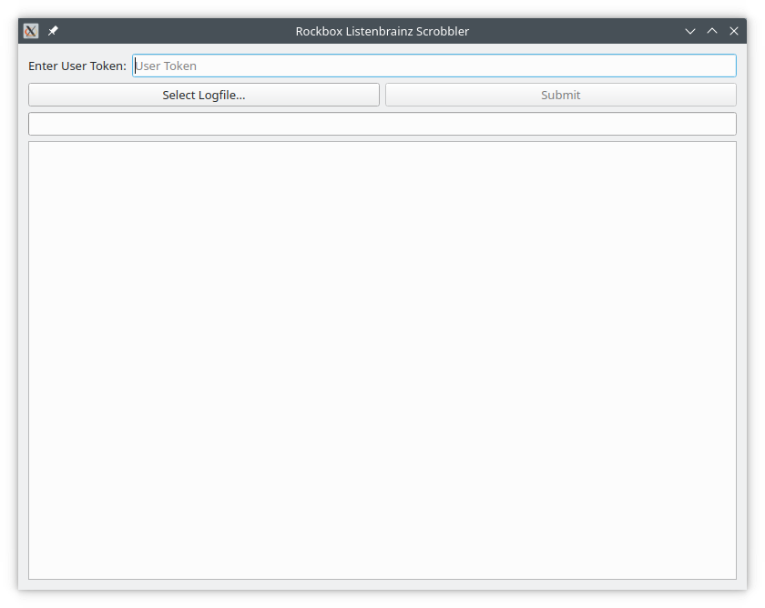

# ROCKBOX LISTENBRAINZ SCROBBLER

A simple application that lets you synchronize your listening data from a `.scrobbler.log` file generated by Rockbox to ListenBrainz.

## Prerequisites

Before using this application, make sure you have the following:

1. A [Rockbox device](https://www.rockbox.org/) configured to generate `.scrobbler.log` files.
2. A [ListenBrainz account](https://listenbrainz.org/) and associated user token.

## Installation

No installation is required. Simply download the latest binary from the [release page](https://github.com/AnotherStranger/rockbox-scrobbler/releases) and execute the binary.

## Usage

1. Enter your ListenBrainz user token in the input field provided. You can get your token [here](https://listenbrainz.org/settings/).
2. Click on **Select Logfile** and browse to the location of your `.scrobbler.log` file.
3. Click on **Submit** to start submitting the listening data to ListenBrainz.

## Code Structure

The application consists of two main parts:

1. **UI**: Defined in `rockbox_listenbrainz_scrobbler/ui.py`. It uses PySide6 to build a graphical interface that allows users to interact with the application.
2. **Scrobbling**: Located in `rockbox_listenbrainz_scrobbler/scrobbling.py`. It contains functions responsible for reading the log file, validating the user token, and communicating with the ListenBrainz API to submit the listening data.

## Contributing

Contributions are welcome! Feel free to open pull requests or issues on GitHub.

## License

This project is licensed under the terms of the MIT License - see the [LICENSE](./LICENSE) file for details.

## Disclaimer

This software is provided as-is without warranty of any kind, either expressed or implied.
